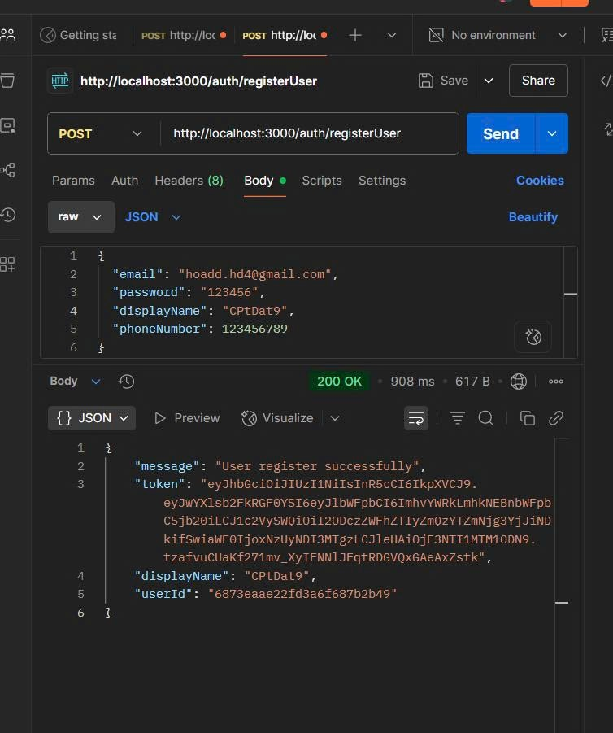
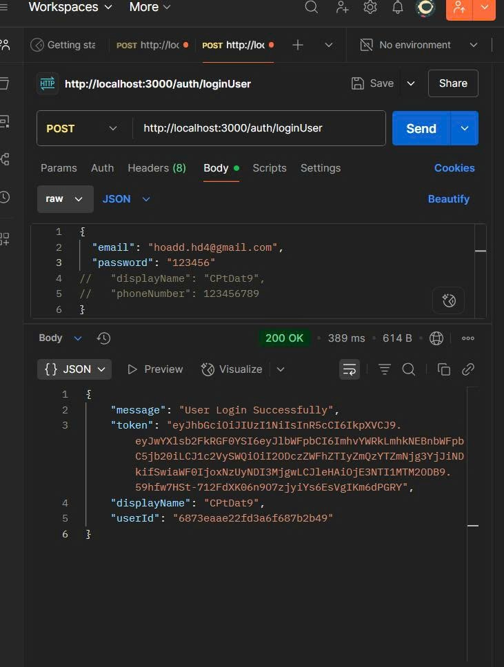

# nodejs-mongoose-jwt-authentication
Sign-Up/Sign-In using Node.js, MongoDB and JWT(JSON Web Token).

## Test: 

**Tool:**

1. Node.js
2. Yup (validate)
3. Mongoose
4. JSON Web Token
5. Express.js
6. Swagger
